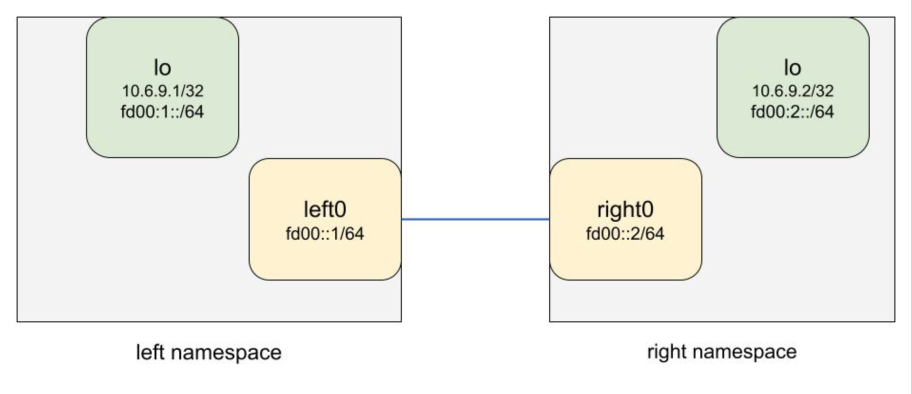

# IPv4 via IPv6 Linux netns Demo

A simple Linux network namespace demo of IPv4 via IPv6 next hops on a point to point link.

## Lab topology

We have two Linux network name spaces:

- Left (on the left of the diagram)
- Right (on the right of the diagram)



They are directly connected and have some IPv4 and IPv6 prefixes on their respective
`lo` interfaces. This lab we'll setup IPv4 routing via IPv6 to see it working in action.

## Requirements

- Linux >= 5.2 (kernel)
- `sudo` access or `NET_ADMIN` capability
- iproute2 / `ip` command to drive netlink
- python >= 3.8
  - Unless you want to configure the netns yourself

## Create netns

### Install json2netns

- `python3 -m venv /tmp/j [--upgrade-deps]`
- `/tmp/j/bin/pip install json2netns`

### Create the network namespaces with json2netns

- `sudo /tmp/j/bin/json2netns p2p_json2netns.json create`

```console
cooper@home1:~/repos/v4v6demo$ sudo /tmp/j/bin/json2netns p2p_json2netns.json create
[2022-07-14 05:07:07,314] INFO: Created veth left0 with peer right0 (interfaces.py:156)
[2022-07-14 05:07:07,328] INFO: Added left namespace (netns.py:82)
[2022-07-14 05:07:07,399] INFO: Added 69::1/64 to left0 in left namespace (interfaces.py:50)
[2022-07-14 05:07:07,402] INFO: Added fe80::1/64 to left0 in left namespace (interfaces.py:50)
[2022-07-14 05:07:07,410] INFO: Added 10.6.9.1/32 to lo in left namespace (interfaces.py:50)
[2022-07-14 05:07:07,413] INFO: Added fd00:1::/64 to lo in left namespace (interfaces.py:50)
[2022-07-14 05:07:07,416] INFO: Finished setup of left namespace (netns.py:196)
[2022-07-14 05:07:07,420] INFO: Added right namespace (netns.py:82)
[2022-07-14 05:07:07,463] INFO: Added 69::2/64 to right0 in right namespace (interfaces.py:50)
[2022-07-14 05:07:07,466] INFO: Added fe80::2/64 to right0 in right namespace (interfaces.py:50)
[2022-07-14 05:07:07,476] INFO: Added 10.6.9.2/32 to lo in right namespace (interfaces.py:50)
[2022-07-14 05:07:07,478] INFO: Added fd00:2::/64 to lo in right namespace (interfaces.py:50)
[2022-07-14 05:07:07,482] INFO: Finished setup of right namespace (netns.py:196)
```

- Lets check the netns
  - `/tmp/j/bin/json2netns check`

```console
# Checking left
## Addresses
1: lo: <LOOPBACK,UP,LOWER_UP> mtu 65536 qdisc noqueue state UNKNOWN group default qlen 1000
    link/loopback 00:00:00:00:00:00 brd 00:00:00:00:00:00
    inet 127.0.0.1/8 scope host lo
       valid_lft forever preferred_lft forever
    inet 10.6.9.1/32 scope global lo
       valid_lft forever preferred_lft forever
    inet6 fd00:1::/64 scope global 
       valid_lft forever preferred_lft forever
    inet6 ::1/128 scope host 
       valid_lft forever preferred_lft forever
50: left0@if49: <BROADCAST,MULTICAST,UP,LOWER_UP> mtu 1500 qdisc noqueue state UP group default qlen 1000
    link/ether a2:37:66:5d:84:ad brd ff:ff:ff:ff:ff:ff link-netns right
    inet6 69::1/64 scope global 
       valid_lft forever preferred_lft forever
    inet6 fe80::a037:66ff:fe5d:84ad/64 scope link 
       valid_lft forever preferred_lft forever
    inet6 fe80::1/64 scope link 
       valid_lft forever preferred_lft forever
## Routes (v4)
## Routes (v6)
69::/64 dev left0 proto kernel metric 256 pref medium
fd00:1::/64 dev lo proto kernel metric 256 pref medium
fe80::/64 dev left0 proto kernel metric 256 pref medium

# Checking right
## Addresses
1: lo: <LOOPBACK,UP,LOWER_UP> mtu 65536 qdisc noqueue state UNKNOWN group default qlen 1000
    link/loopback 00:00:00:00:00:00 brd 00:00:00:00:00:00
    inet 127.0.0.1/8 scope host lo
       valid_lft forever preferred_lft forever
    inet 10.6.9.2/32 scope global lo
       valid_lft forever preferred_lft forever
    inet6 fd00:2::/64 scope global 
       valid_lft forever preferred_lft forever
    inet6 ::1/128 scope host 
       valid_lft forever preferred_lft forever
49: right0@if50: <BROADCAST,MULTICAST,UP,LOWER_UP> mtu 1500 qdisc noqueue state UP group default qlen 1000
    link/ether 96:ef:29:6c:80:fc brd ff:ff:ff:ff:ff:ff link-netns left
    inet6 69::2/64 scope global 
       valid_lft forever preferred_lft forever
    inet6 fe80::94ef:29ff:fe6c:80fc/64 scope link 
       valid_lft forever preferred_lft forever
    inet6 fe80::2/64 scope link 
       valid_lft forever preferred_lft forever
## Routes (v4)
## Routes (v6)
69::/64 dev right0 proto kernel metric 256 pref medium
fd00:2::/64 dev lo proto kernel metric 256 pref medium
fe80::/64 dev right0 proto kernel metric 256 pref medium
```

## Lab Time

The `ip` command is the swiss army knife of Linux network interfaces.
We will be using it to login and control our network namespaces network interface (veth).

- Login to each netns
  - `sudo ip netns exec left /bin/bash`
  - `sudo ip netns exec right /bin/bash`
- Test your p2p ping is up from left netns
  - `ping 69::2`
  - `ping fe80::2%left0`
    - When ever you ping a link local address an interface *MUST* be specified
    - This is cause every IPv6 enabled interface is connected to local scoped fe80::/64 by default ...
- Lets see it in our neighbor table now
  - `ip -6 neigh`
    - We should see both addresses
- Lets ping the right lo interface prefixes
  - `ping 10.6.9.2`
  - `ping fd00:2::`
    - They should both fail with `ping: connect: Network is unreachable`
    - This is cause we have no route to those prefixes
- To see the route for a particular prefix the `ip get` command is your friend
  - `ip route get 10.6.9.2`
  - `ip route get fd00:2::`
    - NETLINK will have no route and say `RTNETLINK answers: Network is unreachable`
- So, lets add some routes
  - `ip route add 10.6.9.2/32 via inet6 69::2`
  - `ip route add fd00:2:: via 69::2`
- Lets ping both again
  - `ping 10.6.9.2`
  - `ping fd00:2::`
    - IPv6 gets responses - but our IPv4 does not? Why??
    - Reason:
      - Our ICMP ping request has the source address of 10.6.9.1 and right netns has not route to that
      - Our ICMPv6 has the source address of our egress interface 69::1, which right is directly connected
        to so it has a route for the ICMPv6 echo reply packet
- ping from the lo IPv6 interface and it too will fail
  - `ping -I fd00:1:: fs00:2::`
- Go to right netns and add a route back to 10.6.9.1 + fd00:1::
  - `ip route add 10.6.9.1/32 via inet6 69::1`
  - `ip route add fd00:1::/64 via 69::1`
- ping the IPv4 from each netns - It should now work!
  - `ping 10.6.9.2` - from left
  - `ping 10.6.9.1` - from right
    - pinging both IPv6 lo prefixes now should also work sourcing from either IPv6 address in each netns

**Congraduations, you've just sent your first IPv4 packets via an IPv6 next hop!**
I am sure you life will never get better. Congrats on hitting peak life.

## Delete netns

This will delete the two network namespaces. Use this when done playing.

- `sudo /tmp/j/bin/json2netns p2p_json2netns.json delete`

```console
cooper@home1:~/repos/v4v6demo$ sudo /tmp/j/bin/json2netns p2p_json2netns.json delete
[2022-07-14 05:26:40,492] INFO: Deleted left namespace (netns.py:82)
[2022-07-14 05:26:40,495] INFO: Deleted right namespace (netns.py:82)
```
